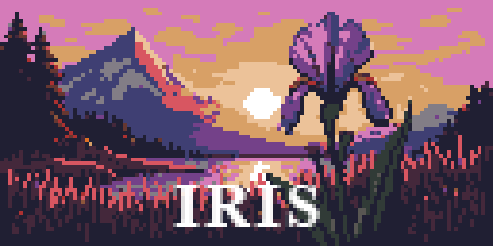

<div align="center">

  
  <h2></h2>
  <h3>WIP UCI Chess Engine</h3>

  [![License][badge-license]][link-license]
  <br>
  [![Release][badge-release]][link-release]
  [![Commits][badge-commits]][link-commits]

</div>

## Overview
Iris is an UCI chess engine written in c++ that I started in April 2025. The name Iris derives from the flower iris, which symbolizes trust, hope, knowledge, and courage. The name also alludes to Iris, the goddess of the rainbow 🏳️‍🌈.

## Usage
Iris doesn't come with a graphical user interface (GUI). To play against it, you have to download a chess GUI that supports the Universal Chess Interface (UCI) protocol such as cutechess, en-croissant, etc.

## Build
Currently, you can only build Iris with `g++` that supports `c++ 20`.
```
git clone https://github.com/citrus610/iris
cd iris
make
```

## Thanks
- Members of the MinusKelvin & Engine Programming discord server for helping me, they are very cool ❤️
- [MinusKelvin](https://github.com/MinusKelvin) and [Analog Hors](https://github.com/analog-hors) for generously allowing me into their [Openbench](https://analoghors.pythonanywhere.com/) instance
- Disservin's [chess-library](https://github.com/Disservin/chess-library) for helping me understand move generation, my move generation code is heavily influenced by theirs
- [CPW](https://www.chessprogramming.org/Main_Page) for its resources
- [Bullet](https://github.com/jw1912/bullet) as the nnue trainer
- The following engines that I use as references:
  - [Ethereal](https://github.com/AndyGrant/Ethereal)
  - [Alexandria](https://github.com/PGG106/Alexandria)
  - [Obsidian](https://github.com/gab8192/Obsidian)
  - [Reckless](https://github.com/codedeliveryservice/Reckless)

[badge-license]: https://img.shields.io/github/license/citrus610/iris?style=for-the-badge&label=license&color=success
[badge-release]: https://img.shields.io/github/v/release/citrus610/iris?style=for-the-badge&label=official%20release
[badge-commits]: https://img.shields.io/github/commits-since/citrus610/iris/latest?style=for-the-badge

[link-license]: LICENSE
[link-release]: https://github.com/citrus610/iris/releases/latest
[link-commits]: https://github.com/citrus610/iris/commits/master
